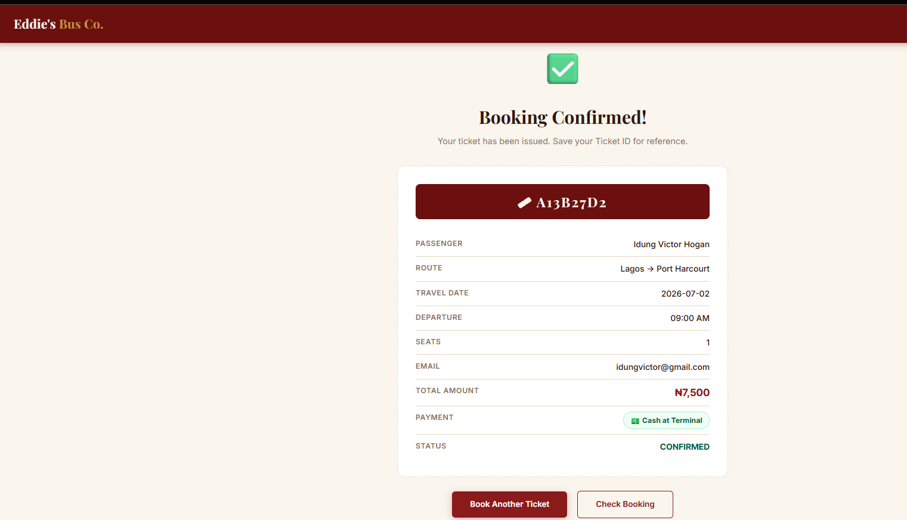
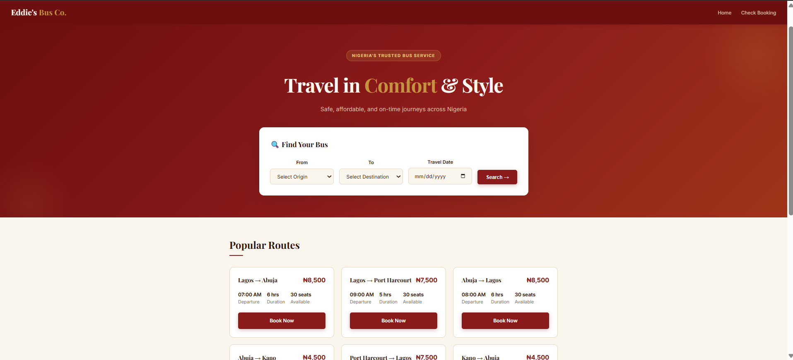
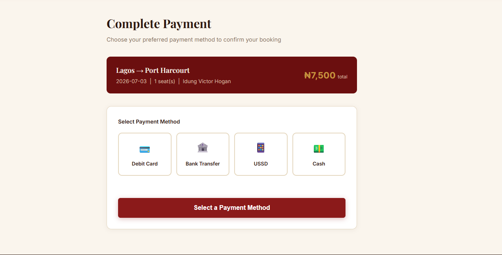

# Eddie’s Bus Company 🚌

### Cloud-Powered Bus Reservation System

   

-----

## Overview

Eddie’s Bus Company is a fully cloud-powered bus ticket reservation system built with Python Flask and AWS DynamoDB. Passengers can search for available routes across Nigeria, book seats, choose a payment method, and receive an instant ticket with a unique ID — all from a clean, modern web interface.

-----

## Features

- Search bus routes by origin, destination, and travel date
- Book seats with full passenger details
- Choose from 4 payment methods — Debit Card, Bank Transfer, USSD, and Cash
- Instant ticket generation with a unique UUID-based Ticket ID
- Full booking confirmation page with ticket summary
- Check any booking using just the Ticket ID
- All bookings stored securely in AWS DynamoDB

-----

## Tech Stack

|Layer      |Technology                                            |
|-----------|------------------------------------------------------|
|Backend    |Python 3.11, Flask                                    |
|Database   |AWS DynamoDB (NoSQL, Pay-per-request)                 |
|Hosting    |AWS Elastic Beanstalk with Auto Scaling               |
|Frontend   |HTML5, CSS3, Jinja2 Templates                         |
|Fonts      |Playfair Display, Inter (Google Fonts)                |
|Environment|python-dotenv                                         |
|Security   |UUID ticket IDs, environment variables for credentials|

-----

## Project Structure

```
eddies-bus/
├── app.py                    Main Flask application and all routes
├── create_table.py           One-time DynamoDB table creation script
├── requirements.txt          Python package dependencies
├── Procfile                  Elastic Beanstalk run command
├── .env                      Environment variables (never push to GitHub)
├── .env.example              Safe template for .env
├── .gitignore                Files excluded from GitHub
└── templates/
    ├── base.html             Shared layout, navigation, styles, footer
    ├── index.html            Homepage with search form and popular routes
    ├── search_results.html   Filtered route search results
    ├── book.html             Passenger details booking form
    ├── payment.html          Payment method selection and processing
    ├── confirmation.html     Ticket confirmation with full booking details
    └── check_booking.html    Look up any booking by Ticket ID
```

-----

## Available Routes

|Route                |Departure|Duration|Price |
|---------------------|---------|--------|------|
|Lagos → Abuja        |07:00 AM |6 hrs   |₦8,500|
|Lagos → Port Harcourt|09:00 AM |5 hrs   |₦7,500|
|Abuja → Lagos        |08:00 AM |6 hrs   |₦8,500|
|Abuja → Kano         |10:00 AM |3 hrs   |₦4,500|
|Port Harcourt → Lagos|06:00 AM |5 hrs   |₦7,500|
|Kano → Abuja         |11:00 AM |3 hrs   |₦4,500|

-----

## Payment Methods

- 💳 **Debit Card** — Simulated card payment with card number, expiry, and CVV
- 🏦 **Bank Transfer** — Shows bank details and collects transfer reference number
- 📱 **USSD** — Displays USSD code for mobile payment
- 💵 **Cash** — Reserves seat for 30 minutes for payment at the terminal

-----

## Getting Started

### Prerequisites

- Python 3.11 or later
- AWS account with DynamoDB access
- AWS IAM user with `AmazonDynamoDBFullAccess` policy

### Installation

**Step 1: Clone the repository**

```bash
git clone https://github.com/YOUR_USERNAME/eddies-bus-company.git
cd eddies-bus-company
```

**Step 2: Create and activate virtual environment**

```bash
python -m venv venv
```

Windows:

```powershell
venv\Scripts\Activate.ps1
```

Mac or Linux:

```bash
source venv/bin/activate
```

**Step 3: Install dependencies**

```bash
pip install -r requirements.txt
```

**Step 4: Set up environment variables**

Copy the example file and fill in your values:

```bash
cp .env.example .env
```

Your `.env` file should look like this:

```
SECRET_KEY=your-secret-key
AWS_REGION=us-west-2
AWS_ACCESS_KEY_ID=your-aws-access-key-id
AWS_SECRET_ACCESS_KEY=your-aws-secret-access-key
DYNAMODB_TABLE=EddieBusBookings
```

**Step 5: Create the DynamoDB table**

```bash
python create_table.py
```

**Step 6: Run the app**

```bash
python app.py
```

Open your browser and go to: **<http://127.0.0.1:5000>**

-----

## Deployment on AWS Elastic Beanstalk

**Step 1: Install the EB CLI**

```bash
pip install awsebcli
```

**Step 2: Initialize Elastic Beanstalk**

```bash
eb init
```

Select Python as the platform and choose your region.

**Step 3: Create the environment**

```bash
eb create eddies-bus-env
```

**Step 4: Set environment variables**

```bash
eb setenv SECRET_KEY=your-key AWS_REGION=us-west-2 AWS_ACCESS_KEY_ID=your-key AWS_SECRET_ACCESS_KEY=your-secret DYNAMODB_TABLE=EddieBusBookings
```

**Step 5: Open the live app**

```bash
eb open
```

-----

## Environment Variables

|Variable             |Description                              |
|---------------------|-----------------------------------------|
|SECRET_KEY           |Flask session secret key                 |
|AWS_REGION           |AWS region where DynamoDB table is hosted|
|AWS_ACCESS_KEY_ID    |AWS IAM access key ID                    |
|AWS_SECRET_ACCESS_KEY|AWS IAM secret access key                |
|DYNAMODB_TABLE       |DynamoDB table name                      |

-----

## Security

- AWS credentials are stored in environment variables and never hardcoded
- `.env` file is excluded from GitHub via `.gitignore`
- Ticket IDs are UUID-based and cannot be guessed or duplicated
- Ticket prices are calculated server-side to prevent manipulation

-----

## How It Works

1. Passenger searches for a route on the homepage
1. Available routes are displayed with price, departure time, and duration
1. Passenger clicks Book Seat and fills in personal details
1. Passenger is redirected to the payment page and selects a payment method
1. On confirmation, a unique Ticket ID is generated and the booking is saved to DynamoDB
1. Passenger can retrieve their booking anytime using the Ticket ID on the Check Booking page

-----

## Screenshots

> Add screenshots of your homepage, booking form, payment page, and confirmation page here.   

-----

## Author

**Idung Victor** — Cloud & DevOps Engineer

